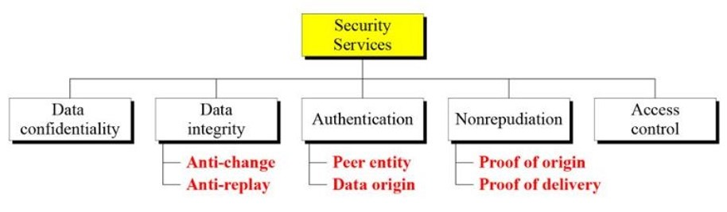

<!-- cry m0-1 -->
# Introduction to Symmetric-Key Encipherment:

 * Security Goals, 
 * Cryptographic Attacks, 
 *  Services and mechanism, 
 *  Techniques.

# Traditional Symmetric-Key Ciphers:

  * Introduction,
  * Substitution Ciphers, 
  * Transposition Ciphers.
---------------------------------------
* # Introduction
* In this era of computers and technology, Information is an asset.
* Facebook and Google are collecting data, extracting valuable information about users.
* The information gathered are usually distributed and not stored at a single place.
* This information must be secured from attacks.

---------------------------------------

* ### Security Goals, 
    * confidentiality 
    * intigrity
    * availability

---------------------------------------

* ### Cryptographic Attacks 
    * #### cryptanalytic attacks (attacks are mathematical)
    * #### non-cryptographic attacks (attacks on security goals)
        * Confidentiality (Snooping and Traffic analysis) -- passive attacks
        * Integrity (Modification, Masquerading, Replaying and Repudiation)  --active attacks
        * Availability (Denial of service) --attack attacks
        * passive vs active attacks

-------------------------------------------
* ### Services and mechanisms
* #### services
   
* #### mechanisms
    * Encipherment
    *  Data Integrity
    *  Digital Signature
    *  Authentication exchange
    *  Traffic padding
    *  Routing control
    * Notarization
    *  Access control

* services and mechanisms relation 
    ![mechanisms][img/mechanisms.png]

------------------------------------
* ###  Techniques.
    * #### crytography (Cryptography – art of secret writing)
        * Symmetric key Encipherment
        * Asymmetric key Encipherment
        * Hashing

    * #### steganography(covered writing)
        * text cover 
        * image cover
        * other cover
-------------------------------------------------------------------------------------

-------------------------------------------------------------------------------------

